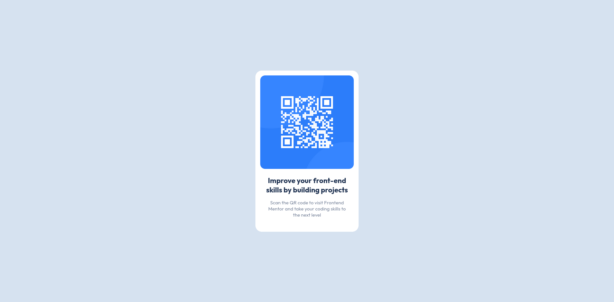

# Frontend Mentor - QR code component solution

## Table of contents

- [Overview](#overview)
  - [Screenshot](#screenshot)
  - [Links](#links)
  - [Author](#author)

## Overview

### Screenshot

### Links

- Solution URL: [Github](https://github.com/whicker132/QR-code)
- Live Site URL: [Vercel](https://qr-code-opal-nine.vercel.app/)

### Author

- Github - [@Whicker132](https://github.com/whicker132)
- Frontend Mentor - [@Whicker132](https://www.frontendmentor.io/profile/whicker132)
